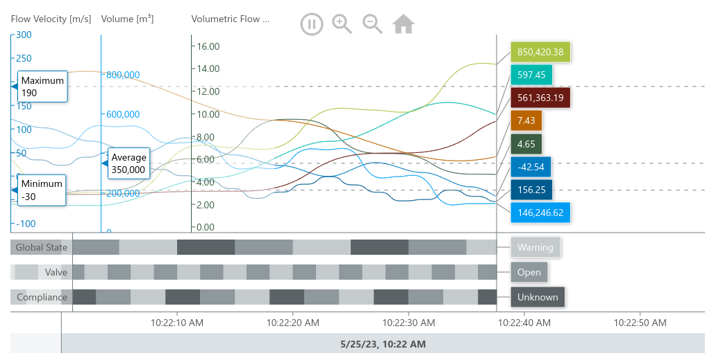

# MeisterCharts

MeisterCharts is a versatile charting API that offers a variety of
modules to meet different charting needs.

- npm package: [www.npmjs.com/package/@meistercharts/meistercharts](https://www.npmjs.com/package/@meistercharts/meistercharts)

## Example chart

This charts shows a ``TimelineChart``.
This Chart type is used to visualize
data over time.



## Quickstart: Installing and use Meistercharts

This is only a quick guide how to install meistercharts and use it. Methods
to use meistercharts in other ways and more detailed are listed in the [](meistercharts-examples) module

### Install from npm

install the meistercharts package
```
npm install @meistercharts/meistercharts
```

create a div container

```HTML
<div id="timeLineChart"></div>
```

create your first chart and initialize it with sample data:

```js
const meisterCharts = require('@meistercharts/meistercharts/meistercharts-easy-api');
// create a new TimeLineChart
let chart = meisterCharts.createTimeLineChartFromId('timeLineChart');
// create the first sample data
chart.setUpDemo();
```

## For Devs

To build the project follow the steps described in [How To Build](how-to-build.md)

### Architecture & conventions

See [architecture/](architecture/) for architecture notes and conventions, including:

- [Config objects: `Configuration` vs. `Style`](architecture/config-objects.md)
- [Configuration properties & the repaint model](architecture/configuration-properties.md)

### Modules Overview

Platform-independent modules (`commonMain`) compile to both JVM and JS; the JVM test source
set runs the unit tests. Platform-specific modules (`-fx`, `-react`) provide the bindings for
one target.

| Module | Platform | Purpose |
|--------|----------|---------|
| `meistercharts-core` | independent | Core primitives: math, geometry, model, color, time, i18n. |
| `meistercharts-canvas` | independent | The charting engine — layers, gestalten, painters, paintables, canvas abstraction. |
| `meistercharts-history` | independent | History data model, chunks and serializers (`-history-api`, `-history-core`); usable over REST. |
| `meistercharts-additional-charts` | independent | Additional, less commonly used chart types built on the engine. |
| `meistercharts-api` / `meistercharts-easy-api` | JS | The simplified, JS-facing API and WebComponents (`createTimeLineChartFromId`, `setData`/`setStyle`). |
| `meistercharts-data` | independent | Data transfer / REST layer (`-data-api`, `-data-client`, `-data-server`). |
| `meistercharts-demos` | independent | Interactive demo gallery — every property adjustable at runtime (`-demos`, `-demos-js`, `-demos-react`). |
| `meistercharts-fx` | JavaFX | JavaFX platform implementation, used as a fast development/preview platform. |
| `meistercharts-react` / `meistercharts-react-kotlin` | React | React integration: TypeScript components and their Kotlin bindings. |
| `meistercharts-examples` | JS | Standalone usage examples for different bundlers (npm, yarn, vite). |
| `meistercharts-e2e-tests` | JS | Playwright end-to-end and screenshot regression tests. |
| `meistercharts-docs` | — | This developer documentation (AsciiDoc). |
| `meistercharts-version-info` | independent | Resolves the current version number as a constant. |
