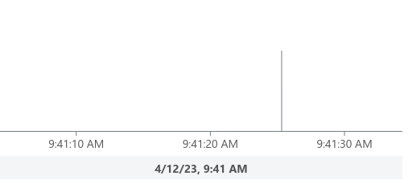

## Getting Started
This is an example that shows how to use MeisterCharts with Vite and NPM Package Manager.

### System Requirements

#### 1. Node.js

Before installing and using the NPM package manager, you will need to have Node.js installed. To see if you already have Node.js installed,
type the following command into your local command line terminal:

```shell
node -v
```
If you see a version number, Node.js is installed.
To install Node.js, follow <a href="https://nodejs.org/en">this link</a>

### Add MeisterCharts to an existing Vite Project

#### 1. Adding Dependencies
add meistercharts to the dependencies:
```shell
yarn add @meistercharts/meistercharts
```
Your ``package.json`` should now contain the MeisterCharts dependency:
```json
"dependencies": {
  "@meistercharts/meistercharts": "^1.31.0"
}
```
That's all you need to do. Now your project is ready to use MeisterCharts.
The next step is to implement MeisterCharts in your code.

#### Import MeisterCharts and create your first Chart
```js
import * as meisterCharts from '@meistercharts/meistercharts';
// create your first timeLineChart
meisterCharts.createTimeLineChartFromId('timeLineChart');
```

* Add a new div to your webpage. The ID of the div is accessed by the ``createTimeLineChartFromId`` and the
  chart will be created in this container.
```HTML
<div id="timeLineChart" style="width: 500px; height: 200px;"></div>
```

After we created the chart you should now see the following chart on your browser
<p align="center">

</p>

### Run this example project
First you need to install all Dependencies:
```shell
npm install
```

After installing all dependencies you can run the following command:
```shell
npm run dev
```
Now you can open <a href="http://localhost:5173/"><b>http://localhost:5173</b></a>
