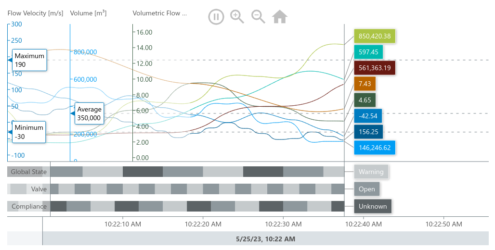

= Getting Started

== Requirements
For this example no requirements are needed. It shows how you can run MeisterCharts directly on pure
HTML and JavasScript without any Package Manager and bundling tools.

== Download and Install MeisterCharts

=== option 1: Installation with our CDN

[source,HTML]
----

----

=== option 2: Load MeisterCharts from the CDN as ECMAScript modules

You can import ES Modules directly into your Browser without needing any bundling tools.

[source,HTML]
----

----

== Your First Chart
With MeisterCharts included in your webpage you are ready to create your first chart.

Add a div in your webpage.

[source,html]
----

----

The ID of the div is accessed by the ``createTimeLineChartFromId`` and the
chart will be created in this container.

=== Adding Data to your chart

You can add your first sample data with the ``setUpDemo()`` method:

[source,js]
----
meistercharts.setUpDemo();
----

After we created the chart you should now see the following chart on your browser

If you are facing any problems you can clone this example project
or just try this code snippet:

[source,html]
----
<!DOCTYPE html>
<html lang="en">
<head>
  <meta charset="UTF-8">
  <title>MeisterCharts Demo</title>
  <link rel="stylesheet" href="style.css"/>
</head>
<body>

  <h1>MeisterCharts minimal example:</h1>

  

    <h3>TimeLineChart</h3>
  

  

</body>
</html>
----

