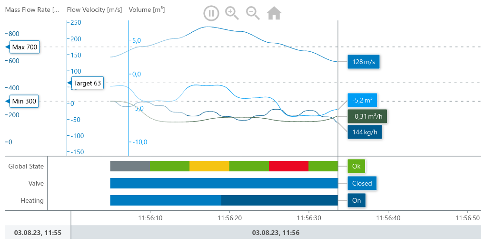

= Meistercharts minimal NPM example

== Getting Started

This is an example that shows how to use MeisterCharts with the NPM package
Manager for your Project

=== System Requirements

==== Node.js
Before installing and using the NPM package manager, you will need to have Node.js installed. To see if you already have Node.js installed,
type the following command into your local command line terminal:

[source,shell]
----
node -v
----
If you see a version number node is installed.
To install Node.js, follow https://nodejs.org/en[this link].

Now you have all you need to use the MeisterCharts API.

=== Add MeisterCharts to an existing NPM Project

==== 1. Adding Dependencies
add meistercharts to the dependencies:

[source,shell]
----
npm install @meistercharts/meistercharts
----
Your ``package.json`` should now contain the MeisterCharts dependency:

[source,json]
----
{
  "name": "npm-meistercharts-minimal",
  "main": "src/index.js",
  "author": "NeckarIT",
  "license": "Apache-2.0",
  "dependencies": {
    "@meistercharts/meistercharts": "1.38.0"
  },
  "devDependencies": {
    "webpack": "5.91.0",
    "webpack-cli": "5.1.4"
  }
}

----
That is all you need to do. Now your project is ready to use MeisterCharts.
The next step is to implement meistercharts in your code

==== Load MeisterCharts with require and create your first Chart
In this code we implement MeisterCharts and create a new ``TimeLineChart``

[source,js]
----
const meisterCharts = require('@meistercharts/meistercharts/meistercharts-easy-api');
// create a new TimeLineChart
let chart = meisterCharts.createTimeLineChartFromId('timeLineChart');

// create the first sample data
chart.setUpDemo();

----

* Add a new div to your Webpage. The ID of the div is accessed by the ``createTimeLineChartFromId`` and the
  chart will be created in this container.

[source,HTML]
----
<!DOCTYPE html>
<html lang="en">
  <head>
    <meta charset="UTF-8">
    <title>MeisterCharts Demo</title>
    <link rel="stylesheet" href="./style.css"/>
  </head>
  <body>
    

    <h1>MeisterCharts minimal example:</h1>

      

      

      

    

  </body>
</html>

----

After we created the chart you should now see the following chart on your browser

* If you are facing problems you can view the example project files

=== Run this example project
First you need to install all Dependencies:

[source,shell]
----
npm install
----

After installing all dependencies we need to bundle our resources
for our webpage

[source,shell]
----
npx webpack
----

That's all you need to do. You can now open the ``src/index.html``
in your browser and see the example chart
