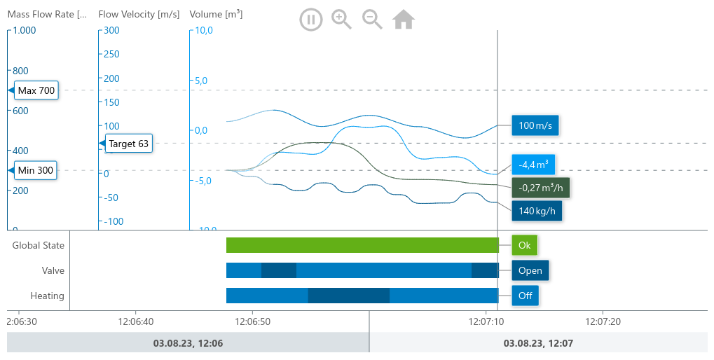

= Vite Meistercharts Minimal Example

== Getting Started
This is an example that shows how to use MeisterCharts with Vite and NPM Package Manager.

=== System Requirements

==== 1. Node.js

Before installing and using the NPM package manager, you will need to have Node.js installed. To see if you already have Node.js installed,
type the following command into your local command line terminal:

[source,shell]
----
node -v
----
If you see a version number, Node.js is installed.
To install Node.js, follow https://nodejs.org/en[this link].

=== Add MeisterCharts to an existing Vite Project

==== 1. Adding Dependencies
add meistercharts to the dependencies:

[source,shell]
----
yarn add @meistercharts/meistercharts
----
Your ``package.json`` should now contain the MeisterCharts dependency:

[source,json]
----
{
  "name": "vite-meistercharts-minimal",
  "author": "NeckarIT",
  "license": "Apache-2.0",
  "type": "module",
  "scripts": {
    "dev": "vite",
    "build": "vite build",
    "preview": "vite preview"
  },
  "devDependencies": {
    "vite": "5.0.7"
  },
  "dependencies": {
    "@meistercharts/meistercharts": "1.38.0"
  }
}

----
That's all you need to do. Now your project is ready to use MeisterCharts.
The next step is to implement MeisterCharts in your code.

==== Import MeisterCharts and create your first Chart

[source,js]
----
import './style.css';
import * as meisterCharts from '@meistercharts/meistercharts';

let chart = meisterCharts.createTimeLineChartFromId('timeLineChart');

// create the first sample data
chart.setUpDemo();

----

* Add a new div to your webpage. The ID of the div is accessed by the ``createTimeLineChartFromId`` and the
  chart will be created in this container.

[source,HTML]
----
<!DOCTYPE html>
<html lang="en">
  <head>
    <meta charset="UTF-8" />
    <meta name="viewport" content="width=device-width, initial-scale=1.0" />
    <title>Vite App</title>
  </head>
  <body>
    
    

      <h1>MeisterCharts Demo Vitejs</h1>
      

      

    

  </body>
</html>

----

After we created the chart you should now see the following chart on your browser

=== Run this example project
First you need to install all Dependencies:

[source,shell]
----
npm install
----

After installing all dependencies you can run the following command:

[source,shell]
----
npm run dev
----

Now you can open **http://localhost:5173/[http://localhost:5173]**
