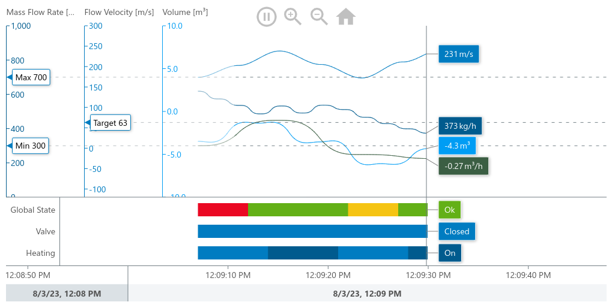

## Getting Started
This is an example that shows how to use MeisterCharts with the Yarn package
Manager for your Project.
### System Requirements

#### 1. Node.js
Before installing and using the Yarn package manager, you will need to have Node.js installed. To see if you already have Node.js installed,
type the following command into your local command line terminal:
```shell
node -v
```
If you see a version number node is installed.
To install Node.js, follow <a href="https://nodejs.org/en">this link</a>

#### 2. Yarn
You have to install Yarn Globally with the following command
```shell
sudo npm install -g yarn
```

Now you have all you need to use the MeisterCharts API.

### Add MeisterCharts to an existing Yarn Project

#### 1. Adding Dependencies
add meistercharts to the dependencies:
```shell
yarn add @meistercharts/meistercharts
```
Your ``package.json`` should now contain the MeisterCharts dependency:
```json
"dependencies": {
  "@meistercharts/meistercharts": "^1.32.0"
}
```

That is all you need to do. Now your project is ready to use MeisterCharts.
The next step is to implement meistercharts in your code

#### Load MeisterCharts with require and create your first Chart
In this code we implement meisterCharts and create a new ``TimeLineChart``
```js
const meisterCharts = require('@meistercharts/meistercharts/meistercharts-easy-api');
// create a new TimeLineChart
meisterCharts.createTimeLineChartFromId('timeLineChart');
meisterCharts.setUpDemo();
```

* Add a new div to your webpage. The ID of the div is accessed by the ``createTimeLineChartFromId`` and the
  chart will be created in this container.

```HTML
<div id="timeLineChart" style="width: 500px; height: 200px;"></div>
```

After we created the Chart you should now see the following chart on your browser
<p align="center">

</p>

* If you are facing problems you can view the example project files

### Run this example project
First you need to install all Dependencies:
```shell
yarn install
```

After installing all dependencies we need to bundle our resources
for our webpage

```shell
yarn webpack
```

You can now open the ``src/index.html``
in your browser and see the example chart
